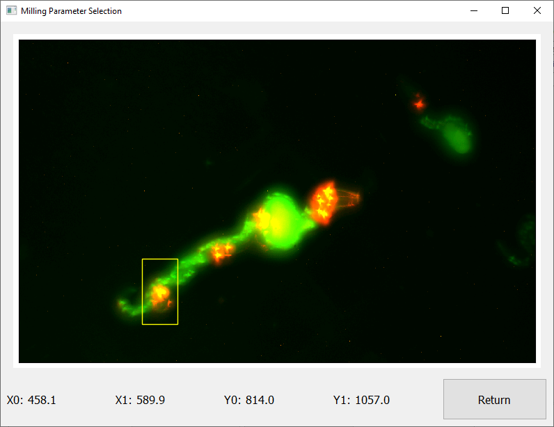
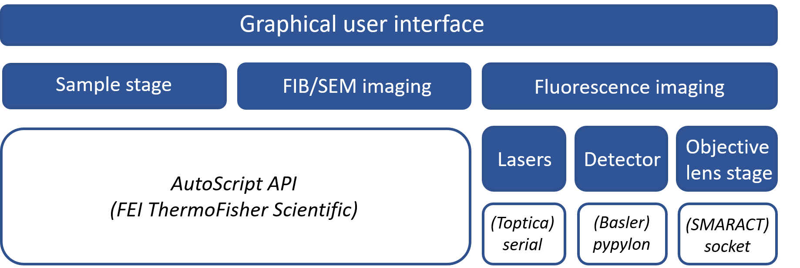

# PIEScope GUI controls

`piescope_gui` is a python package for controlling the
Photon-Ion-Electron microscope (PIE-scope)
[Gorelick *et al.*, eLife 2019](https://elifesciences.org/articles/45919)
via a PyQt graphical user interface.

## Features

* Integrated control of fluorescence and FIB/SEM microscopes.
* Semi-automated registration & alignment of fluorescenc and FIB/SEM images, and overlaid images display.
* Create ion beam milling patterns on the registered and overlaid images.


## Citation
If you find this useful, please cite our work.
See [CITATION](CITATION.md) for details.

## Software license
This software is released under the terms of the GPLv3 license.
There is NO WARRAYNTY either express or implied.
See [LICENSE](LICENSE) for details.

## Dependencies
There are a number of essential hardware and software dependencies.

Hardware requirements
* FIB/SEM microscope (a commercial product by ThermoFisher FEI)
* Basler detector (https://www.baslerweb.com)
* Toptica lasers (for the fluorescence microscope)
* SMARACT stage (controlling the fluorescence objective lens position)

Software requirements
* Python 3.6
* Autoscript software (a commercial product by ThermoFisher FEI)
* The Basler [Pylon Software Suite](https://www.baslerweb.com/en/products/software/basler-pylon-camera-software-suite/)
* The Basler [`pypylon` python package](https://github.com/basler/pypylon)
* The [`piescope` python package](https://github.com/DeMarcoLab/piescope/releases) containing the back-end functionalities
* Other python packages, as specified in the [requirements.txt](requirements.txt) and [requirements-dev.txt](requirements-dev.txt)

## Installation
See [INSTALLATION](INSTALLATION.md) for a detailed guide.

Software developers may also like to refer to the
[development installation guide](DEVELOPERS.md).

## Running the program

First activate your python environment
(the same one you installed piescope into).
Eg: open the Anaconda Prompt from the start menu and type:;;

```
conda activate piescope
```

Then you can launch the GUI using the command:
```
piescope
```

You will then see the main GUI screen appear:


Initially both the FIB/SEM and Fluorescence image display areas in the GUI are empty. The next screenshot shows the GUI with example C. Elegans data displayed:


**Blue outline (left)**: Controls for flourescence image acquisition.

**Red outline (center left)**: Fluorescence image display area and controls.

**Green outline (right)**: FIB/SEM image display area and controls.

### Semi-automated image alignment
An image registration feature is provided, using control point matching to align images of different modalities (i.e. fluorescenc and FIB/SEM images). A screenshot of that interface is shown here:


*Note: the image correlation utility is also available separately as a standalone package.*

Aligned images are then displayed as a transparent overlay.

### Creating ion beam milling patterns
Finally, users may create ion beam milling patterns directly from the registered fluorescence and FIB/SEM images. In the screenshot below, a rectangle pattern is drawn onto the image display and can be run immediately to ablate the sample.



This is a key advantage of the PIE-scope, as not only can we use the surface structural information from the FIB/SEM but also the internal functional information provided by fluorescence imaging.

## Hardware control diagram

This diagram shows the relationship between the hardware components of the PIE-scope.



The FIB/SEM system, controlled via the AutoScript API by FEI ThermoFisher Scientific, encompasses:
* Sample stage movement
* Electron imaging
* Ion beam imaging
* Ion beam milling (ablation of selected regions in the sample)

The fluorescence imaging system includes:
* Toptica lasers, controlled by serial communication (USB connection)
* Basler detector, controlled with the Pylon Software Suite and the `pypylon` python API
* SMARACT objective lens stage, controlled via a socket connection

## Suggested end-to-end workflow
This is the suggested end-to-end workflow for experiments, consisting of six steps:


